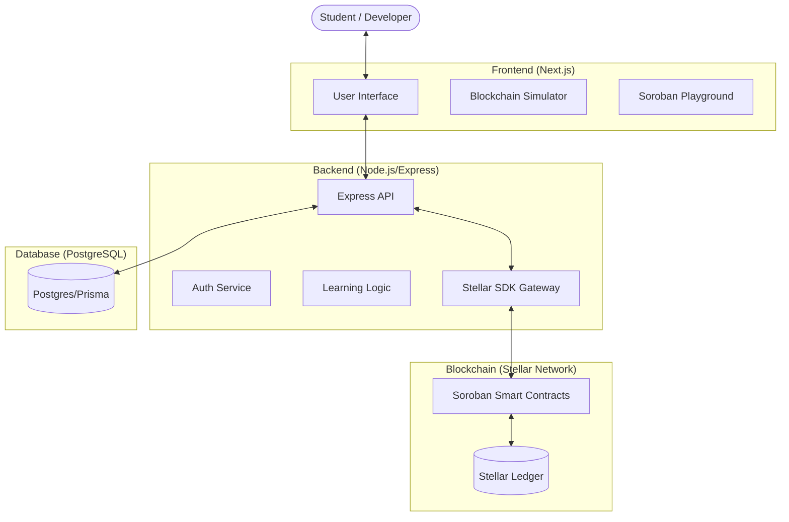
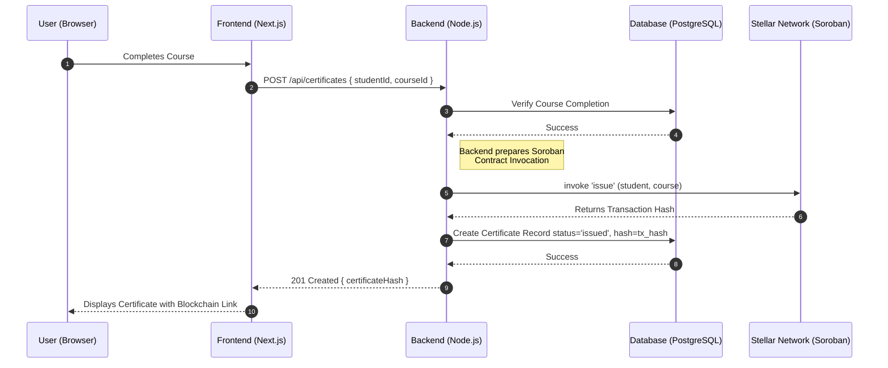
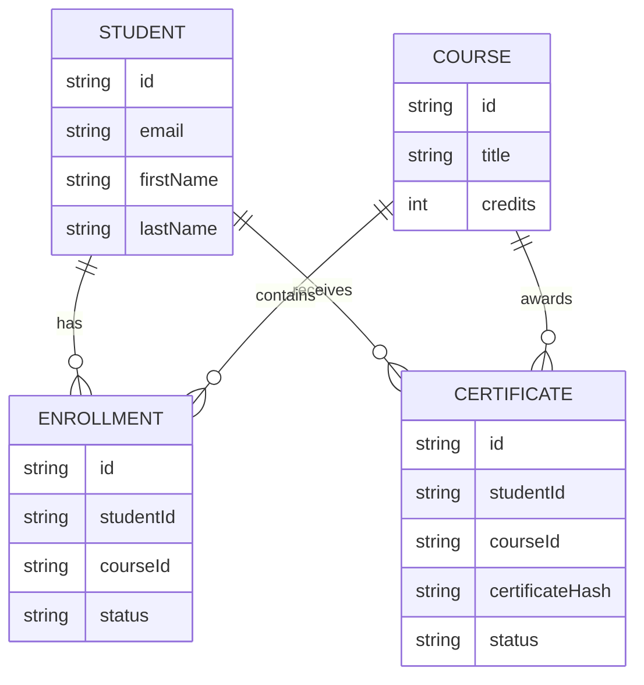

# Architecture Deep Dive: Web3 Student Lab

This document provides a technical deep dive into the architecture of the Web3 Student Lab platform.
It details how the Frontend, Backend, and Stellar Network components work together to provide a
seamless educational experience for blockchain students.

## 🏗️ High-Level System Overview

The Web3 Student Lab follows a modular, 3-tier architecture designed for scalability, security, and
educational clarity.

## 🧩 Component Roles & Responsibilities

### 1. Frontend (The User Experience)

- **Next.js (React)**: Handles routing, state management, and the overall UI.
- **Monaco Editor**: Provides a rich in-browser coding experience for smart contracts.
- **Tailwind CSS**: Ensures a modern, responsive design across all devices.
- **Visual Simulator**: Locally computes and visualizes blockchain concepts (hashes, mining, blocks)
  for educational purposes.

### 2. Backend (The Orchestrator)

- **Node.js & Express**: Provides the RESTful API that the frontend consumes.
- **Prisma ORM**: Manages interaction with the PostgreSQL database, ensuring type-safety and
  efficient queries.
- **Stellar SDK**: Primarily acts as a gateway to the Stellar Network, handling transaction
  preparation, signing (with service keys), and submission.
- **Learning Logic**: Manages course progress, quiz validations, and student profiles.

### 3. Contracts (The Source of Truth)

- **Soroban (Rust)**: Contracts are written in Rust and compiled to WASM for high-performance and
  secure execution.
- **CertificateContract**: Manages the issuance and verification of student certificates directly on
  the Stellar Ledger.
- **TokenContract**: (Optional/Planned) Manages lab-specific rewards or tokens.

---

## 🔄 Core Data & Control Flows

### 🎓 Certificate Issuance Flow

This diagram illustrates the sequence from when a student finishes a course to the moment a
certificate is minted on the Stellar network and recorded in the local database.

## 🗄️ Unified Data Model

The local database maintains a mirror of essential on-chain data to ensure fast response times and
support complex queries (e.g., student leaderboards) that aren't efficient to perform directly
on-ledger.

---

## 🔒 Security & Scaling Considerations

1.  **JWT Authentication**: All communication between the frontend and backend is secured using
    signed JSON Web Tokens.
2.  **Stellar Key Management**: Private keys for contract invocation are managed on the backend
    using environment variables or dedicated secret management services.
3.  **Idempotency**: Blockchain operations use unique identifiers to prevent accidental
    double-issuance of certificates.
4.  **Optimistic UI**: The frontend updates immediately upon backend success, while the blockchain
    finalization happens asynchronously.
