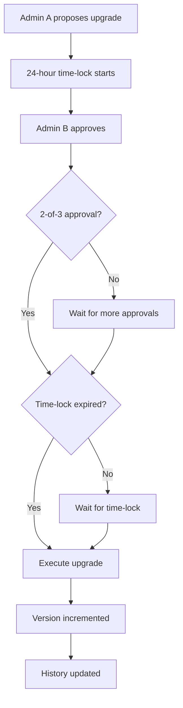
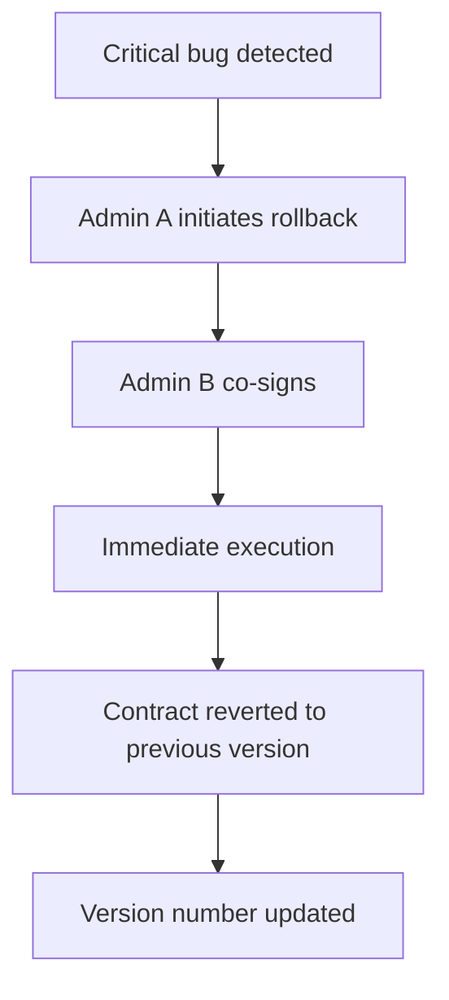

# Upgradeable NFT Certificate Contract - Implementation Guide

## Overview

The Web3-Student-Lab NFT certificate contract now implements a comprehensive upgradeable pattern that allows admin-controlled upgrades while preserving all existing NFT certificates and their metadata.

## Architecture

### Components

```
├── Core Contract (lib.rs)
│   ├── Certificate storage and management
│   ├── Governance and access control
│   └── Upgrade orchestration
├── Upgrade Module (upgrade.rs)
│   ├── Version tracking
│   ├── Time-lock mechanism
│   ├── Rollback capability
│   └── Upgrade history
└── Admin Module (admin.rs)
    ├── Role-based access control
    ├── Permission management
    ├── Multi-signature validation
    └── Ownership transfer
```

## Key Features

### 1. Version Tracking

Every contract upgrade is tracked with comprehensive metadata:

```rust
pub struct ContractVersion {
    pub version: u32,
    pub wasm_hash: BytesN<32>,
    pub upgraded_at: u64,
    pub upgraded_by: Address,
    pub changelog: String,
}
```

**Usage:**
```rust
// Get current version
let version = contract.get_current_version();

// Get version history
let history = contract.get_version_history();

// Get specific version
let v1 = contract.get_version(1);
```

### 2. Time-Lock Mechanism

All upgrades require a 24-hour delay before execution, giving users time to review changes:

```rust
pub const UPGRADE_TIMELOCK_SECONDS: u64 = 86400; // 24 hours
```

**Upgrade Flow:**
1. Propose upgrade → Creates pending upgrade with time-lock
2. Approve upgrade → Requires 2-of-3 governance admins
3. Wait 24 hours → Time-lock period
4. Execute upgrade → Apply the new WASM

**Example:**
```rust
// Step 1: Propose upgrade
let proposal_id = contract.propose_upgrade_with_timelock(
    &admin_a,
    &new_wasm_hash,
    &String::from_str(&env, "Bug fixes and performance improvements")
);

// Step 2: Second admin approves
contract.approve_pending_upgrade(&admin_b);

// Step 3: Wait 24 hours...

// Step 4: Execute after time-lock expires
contract.execute_pending_upgrade(&admin_a);
```

### 3. Multi-Signature Authorization

All critical operations require 2-of-3 governance admin approval:

- Contract upgrades
- Emergency rollbacks
- Ownership transfers
- Mint cap changes

**Example:**
```rust
// Emergency rollback requires 2 different admins
contract.emergency_rollback(
    &admin_a,
    &admin_b,
    &target_version
);
```

### 4. Role-Based Access Control

Three admin roles with different permission levels:

#### Owner Role
- Full control over contract
- Can upgrade, pause, transfer ownership
- Can perform emergency rollbacks

#### Admin Role
- Can mint and revoke certificates
- Can update metadata
- Can pause contract
- Cannot upgrade or transfer ownership

#### Operator Role
- Read-only access
- Can verify certificates
- Cannot modify contract state

**Example:**
```rust
// Add new admin with specific role
contract.add_admin_with_role(
    &owner,
    &new_admin,
    &AdminRole::Admin
);

// Check permissions
let can_upgrade = contract.check_permission(
    &address,
    &Permission::Upgrade
);
```

### 5. Emergency Rollback

In case of critical bugs, admins can rollback to a previous version:

```rust
// Rollback to version 2
contract.emergency_rollback(
    &admin_a,
    &admin_b,
    &2u32
);
```

**Important:** Rollback requires:
- 2-of-3 governance admin signatures
- Target version must exist in history
- Immediate execution (no time-lock)

## Security Considerations

### Multi-Signature Protection

All critical operations require multiple signatures to prevent single point of failure:

```rust
const GOVERNANCE_THRESHOLD: u32 = 2;
const GOVERNANCE_ADMIN_COUNT: u32 = 3;
```

### Time-Lock Protection

24-hour delay for upgrades allows:
- Community review of changes
- Users to exit if they disagree
- Detection of malicious upgrades

### Version History

Up to 10 previous versions are stored for rollback:

```rust
const MAX_VERSION_HISTORY: u32 = 10;
```

### Access Control

Granular permissions prevent unauthorized actions:

```rust
pub enum Permission {
    Upgrade,
    Pause,
    Mint,
    Revoke,
    UpdateMetadata,
    GrantRole,
    RevokeRole,
    TransferOwnership,
    EmergencyPause,
    Rollback,
}
```

## Events

All upgrade-related actions emit events for transparency:

| Event | Data | Description |
|-------|------|-------------|
| `v1_upgrade_proposed` | `(caller, wasm_hash, changelog)` | New upgrade proposed |
| `v1_upgrade_approved` | `(caller, approval_mask)` | Admin approved upgrade |
| `v1_upgrade_executed` | `(caller, wasm_hash)` | Upgrade executed |
| `v1_upgrade_cancelled` | `(caller)` | Upgrade cancelled |
| `v1_emergency_rollback` | `(signer_a, signer_b, version, wasm_hash)` | Emergency rollback performed |
| `v1_admin_added` | `(caller, new_admin, role)` | New admin added |
| `v1_admin_removed` | `(caller, admin)` | Admin removed |
| `v1_ownership_transferred` | `(caller, new_owner)` | Ownership transferred |

## API Reference

### Upgrade Functions

#### `propose_upgrade_with_timelock`
```rust
pub fn propose_upgrade_with_timelock(
    env: Env,
    caller: Address,
    new_wasm_hash: BytesN<32>,
    changelog: String,
) -> u64
```
Propose a new upgrade with 24-hour time-lock.

#### `approve_pending_upgrade`
```rust
pub fn approve_pending_upgrade(
    env: Env,
    caller: Address,
)
```
Approve a pending upgrade (requires governance admin).

#### `execute_pending_upgrade`
```rust
pub fn execute_pending_upgrade(
    env: Env,
    caller: Address,
)
```
Execute upgrade after time-lock expires and 2-of-3 approval.

#### `cancel_pending_upgrade`
```rust
pub fn cancel_pending_upgrade(
    env: Env,
    caller: Address,
)
```
Cancel a pending upgrade.

#### `emergency_rollback`
```rust
pub fn emergency_rollback(
    env: Env,
    signer_a: Address,
    signer_b: Address,
    target_version: u32,
)
```
Rollback to a previous version (requires 2-of-3 admins).

### Version Query Functions

#### `get_current_version`
```rust
pub fn get_current_version(env: Env) -> u32
```
Get the current contract version number.

#### `get_version_history`
```rust
pub fn get_version_history(env: Env) -> Vec<ContractVersion>
```
Get complete version history.

#### `get_version`
```rust
pub fn get_version(env: Env, version: u32) -> Option<ContractVersion>
```
Get details for a specific version.

#### `get_pending_upgrade`
```rust
pub fn get_pending_upgrade(env: Env) -> Option<PendingUpgrade>
```
Get pending upgrade details if one exists.

### Admin Functions

#### `add_admin_with_role`
```rust
pub fn add_admin_with_role(
    env: Env,
    caller: Address,
    new_admin: Address,
    role: AdminRole,
)
```
Add a new admin with specific role.

#### `remove_admin_role`
```rust
pub fn remove_admin_role(
    env: Env,
    caller: Address,
    admin_to_remove: Address,
)
```
Remove an admin.

#### `get_admin_policy`
```rust
pub fn get_admin_policy(
    env: Env,
    address: Address,
) -> Option<AdminPolicy>
```
Get admin policy for an address.

#### `check_permission`
```rust
pub fn check_permission(
    env: Env,
    address: Address,
    permission: Permission,
) -> bool
```
Check if an address has a specific permission.

#### `transfer_ownership`
```rust
pub fn transfer_ownership(
    env: Env,
    caller: Address,
    new_owner: Address,
)
```
Transfer contract ownership.

## Upgrade Workflow

### Standard Upgrade Process



### Emergency Rollback Process



## Testing

Comprehensive test suites are provided:

### Upgrade Tests (`tests/upgrade_test.rs`)
- Version tracking
- Time-lock enforcement
- Multi-signature validation
- Rollback functionality
- Event emission

### Admin Tests (`tests/admin_test.rs`)
- Role-based access control
- Permission management
- Admin addition/removal
- Ownership transfer

**Run tests:**
```bash
cd contracts
cargo test upgrade_tests
cargo test admin_tests
```

## Deployment Checklist

### Initial Deployment
- [ ] Deploy contract with 3 governance admin addresses
- [ ] Verify all admins have correct roles
- [ ] Test upgrade proposal flow on testnet
- [ ] Verify time-lock mechanism works
- [ ] Test emergency rollback capability

### Before Each Upgrade
- [ ] Audit new contract code
- [ ] Test on testnet with real data
- [ ] Prepare detailed changelog
- [ ] Upload new WASM and record hash
- [ ] Notify community of pending upgrade
- [ ] Propose upgrade with time-lock
- [ ] Obtain 2-of-3 admin approvals
- [ ] Wait for 24-hour time-lock
- [ ] Execute upgrade
- [ ] Verify contract behavior
- [ ] Update off-chain clients

### Emergency Procedures
- [ ] Identify critical bug
- [ ] Determine target rollback version
- [ ] Coordinate with 2 governance admins
- [ ] Execute emergency rollback
- [ ] Notify community immediately
- [ ] Prepare hotfix for next upgrade

## Gas Optimization

The implementation is optimized for Soroban's compute limits:

- Efficient storage access patterns
- Minimal storage operations
- Batch operations where possible
- Optimized event emission

## Migration Guide

### From Previous Version

If upgrading from the original contract:

1. **No data migration needed** - All certificate data is preserved
2. **New functions available** - Enhanced upgrade and admin functions
3. **Backward compatible** - All existing functions work as before
4. **New events** - Additional events for upgrade tracking

### Storage Layout

The upgrade maintains storage compatibility:
- Certificate data: Unchanged
- Admin data: Extended with new fields
- Version data: New storage keys added

## Best Practices

### For Governance Admins

1. **Always test on testnet first**
2. **Use hardware wallets for admin keys**
3. **Keep detailed changelogs**
4. **Coordinate upgrade timing with team**
5. **Monitor events after upgrades**
6. **Keep rollback plan ready**

### For Developers

1. **Audit all WASM before proposing**
2. **Test state migrations thoroughly**
3. **Document breaking changes**
4. **Maintain version compatibility**
5. **Use semantic versioning**

### For Users

1. **Monitor upgrade proposals**
2. **Review changelogs during time-lock**
3. **Verify admin signatures**
4. **Report suspicious activity**
5. **Keep track of version history**

## Troubleshooting

### Common Issues

**Issue:** Upgrade execution fails
- **Solution:** Verify time-lock has expired and 2-of-3 approval obtained

**Issue:** Cannot rollback to version
- **Solution:** Check version exists in history (max 10 versions stored)

**Issue:** Permission denied
- **Solution:** Verify caller has required permission for operation

**Issue:** Duplicate approval error
- **Solution:** Each admin can only approve once per proposal

## Security Audit Recommendations

Before production deployment:

1. **Smart contract audit** - Professional security review
2. **Formal verification** - Mathematical proof of correctness
3. **Penetration testing** - Attempt to exploit vulnerabilities
4. **Economic analysis** - Game theory and incentive alignment
5. **Operational security** - Key management and access control

## Support and Resources

- **Documentation:** `/docs` directory
- **Tests:** `/contracts/src/tests`
- **Examples:** See test files for usage examples
- **Issues:** Report bugs via GitHub issues

## Changelog

### Version 1.0.0 (Current)
- Initial upgradeable implementation
- Version tracking system
- Time-lock mechanism (24 hours)
- Multi-signature authorization (2-of-3)
- Role-based access control
- Emergency rollback capability
- Comprehensive event logging
- Full test coverage

## License

Same as parent project license.
